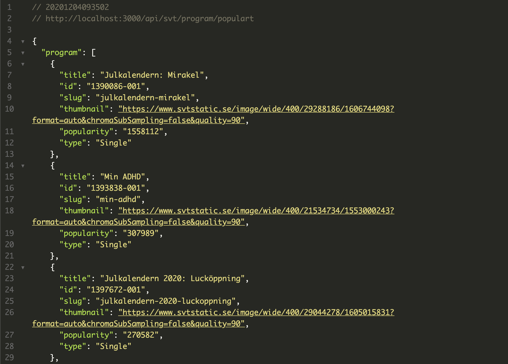
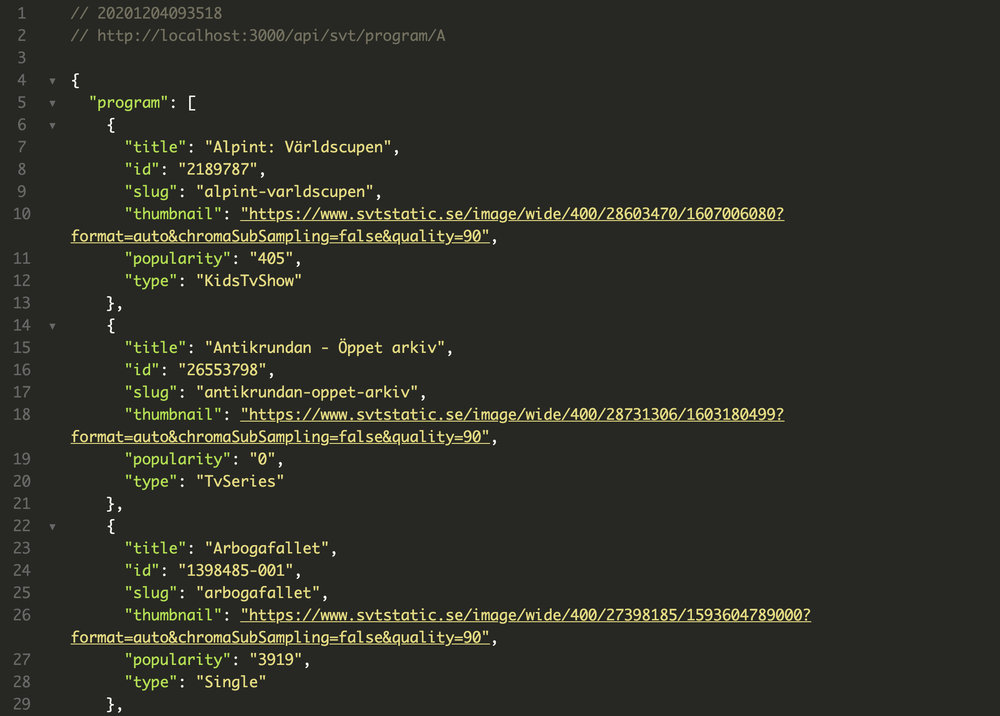
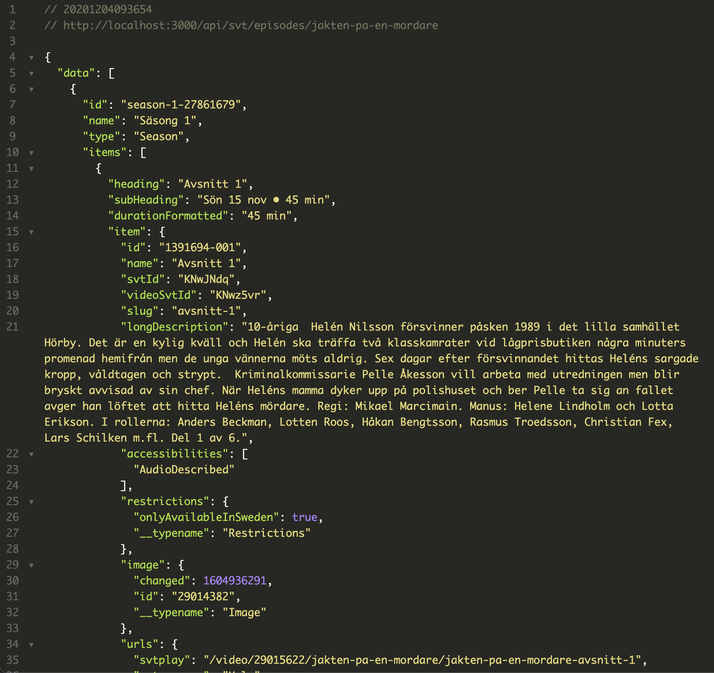

  

  
  
  

# An easy to use API for SvtPlay

#### Built using Node and the Express framework

# Table of Contents

- [An easy to use API for SvtPlay](#An-easy-to-use-API-for-SvtPlay)
- [Table of Contents](#table-of-contents)
  - [What does it do?](#what-does-it-do)
  - [Features](#Features)
  - [Installation](#Istallation)
  - [Requirments](#Requirments)
  - [Run](#Run)

## What does it do

This REST API provides an easy and fast way to interact with SvtPlay's servers. The API provides all neccessary information needed to build a frontend.

## Features

#### Json request for most popular programs

## 

#### Json request for shows/movies on specific letters

## 

#### Json request for episodes

## 

#### Json request for m3u8

## 

## Installation

1. Clone this repository `git clone https://github.com/VGDev1/SvtplayApi`
2. Change directory to project root `cd SvtplayApi`
3. Install the requirments: `npm install`

## Requirments

- Node
- Nodemon
- Redis

## Run

1. Change directory to project root `cd SvtplayApi`
2. Start Redis server: `redis-server`
3. Start cors proxy: `npm run proxy`
4. Start api: `npm run api`
